# DS5500-Assignment-2

## Problem 2
For this problem, I would like to critique my classmate Priya Singh https://github.com/priyasingh16/Gapminder/blob/master/Gapminder.ipynb

Most of her plot is similar to mine and for both her and my plots I think we should have gone with an interactive chart for this kind of dataset. The reason being the number of the categorical variables that are countries are a lot so to Visualize them there needs to be some interaction particularly to toggle between countries such that you can select multiple countries and compare them.

Also, the Plot for individual countries in My classmate is helpful to interpret the relation between income and time for a single country. but when it comes to comparing multiple countries together it becomes difficult as the chart is huge and to find that particular countries itself is difficult and too compare those multiple charts together even more.

The second plot about countries with respect to income and time in a single chart is similar to mine. The chart packs a lot of information in it, in fact too much information for it to be interpretable. The single country chart is more interpretable than this one definitely. But both are not a perfect solution for visualization of this kind.

## problem 3
For this problem, I would like to critique my classmate Manvita Reddy
https://github.com/manvitamarkala/DS-5500---HW1

The choice of the visualization for both me and my classmate is the same which is line plot. I think the chart does justice in conveying the information about the quantities individually for all continents. But if you want to compare them and see the relation between the quantities ie relation between income, child mortality and life expectancy it becomes difficult. I think plotting each quantity together for a single continent in one chart is the way to go here to see the relation between them. Also, in the end, agregating them for all continents is a good plot but it fails to capture the information about a single continent. For example, the child mortality rate in America might be less as compared to Africa but aggregating them together can mislead the information

## Problem 4

Notebook link :
https://github.com/ParthTandel/DS5500-Assignment-2/blob/master/Question_1.ipynb

For seeing the relationship between income and life expectancy I plotted a scatter plot of Life expectancy against GDP to see how they are correlated. Looking at the plot we see that as we increase the income over certain range the life expectancy increases as well and after a certain point, it almost is constant as expected. 
The blue scatters represents the actual Y which is the life expectancy over income. The Yellow line represents the linear fit for the variable Life expectancy over GDP income. We can see that it fails to actually establish a correct representation between the variable. So does the 2nd degree and 3rd-degree polynomial regressor.

#### Plot for life expectancy over income gdp
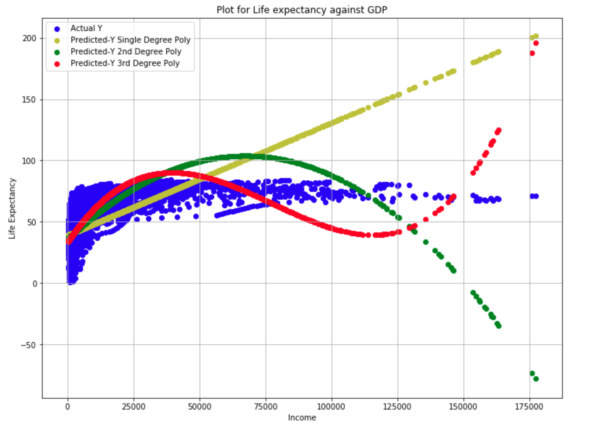

The mean square error I got for all the regressors are as follows
    
    Mean square error for linear 1st-degree linear regression: 178.20974789819934
    Mean square error for linear 2nd-degree linear regression: 129.81171346584082
    Mean square error for linear 3rd-degree linear regression: 105.52296176335349

We can see that the mean square error decreases as we increase the degree of the polynomial but still the error is high

#### Residual plot for life expectancy over income gdp

For each residual wee can see that it is moving away from 0 and thereby increase the error

#### Further Analysis

Looking at the plot of life expectancy over income we see some form of log relation between them and both are variables that are directly proportional to each other as we see that if the income increases the life expectancy increases. 
So to see the logarithmic relation I fit the models with log-transformed Income GDP and observed the result.
 
Looking at the plot we can see that the lines for all the regressors are better fitting the relationship between life expectancy and income GDP. The 3rd-degree regressor over the log(income-GDP) fits the life expectancy best in comparison to all the models.

#### Plot for life expectancy fitter over log transformed income gdp
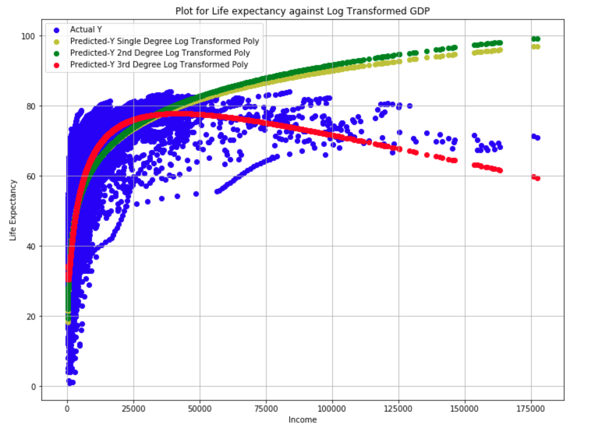

The mean square error for the new regressor got for all the regressors are as follows

    Mean square error for linear 1st-degree linear regression: 87.18455865550399
    Mean square error for linear 2nd-degree linear regression: 87.1171175681947
    Mean square error for linear 3rd-degree linear regression: 80.18137845255467

we can see that For all the regressor the mean square error has gone down for all the regressors.

#### Residual plot for life expectancy over income gdp
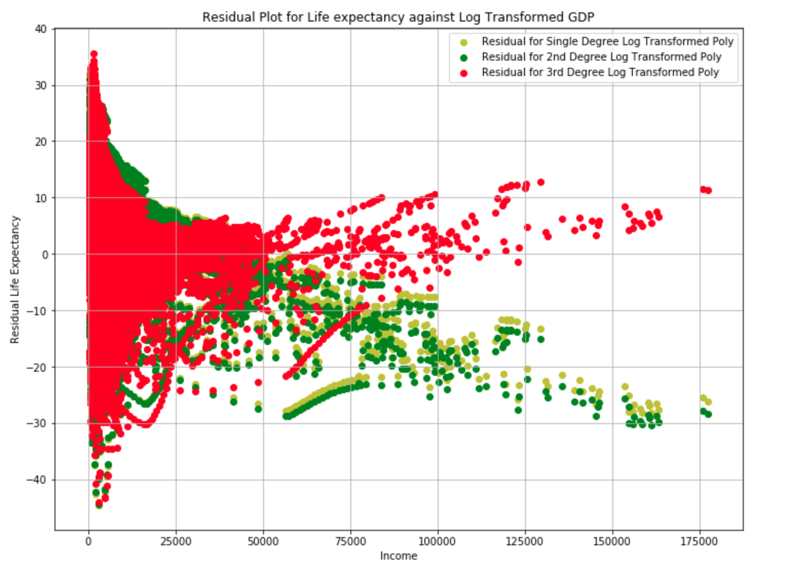

The residual for the third degree is close to 0 and better than all the resistors some of this may be because the model is overfitted a bit.

#### Relationship with respect to time.

If we introduce time in the above we see that the prediction becomes better. This is because time introduces a new dimension to the prediction by capturing the trends of how there has been an improvement in both income and life expectancy over time. This basically may show better medical equipment, quality of life etc over time.

We see each regressor better captures the relation than any of the above models.

#### Plot for life expectancy fitter over log transformed income gdp with respect to time
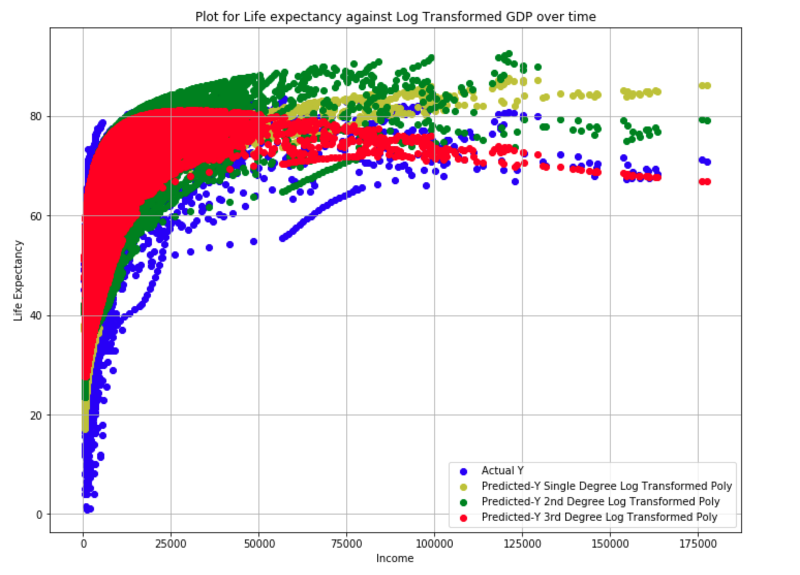

The mean square error for the are as follows

    Mean square error for linear 1st-degree linear regression: 55.79034619374027
    Mean square error for linear 2nd-degree linear regression: 36.18285625361796
    Mean square error for linear 3rd-degree linear regression: 32.491320843692016

we can see that for all the regressor the mean square error has gone down significantly less than the previous regressors.

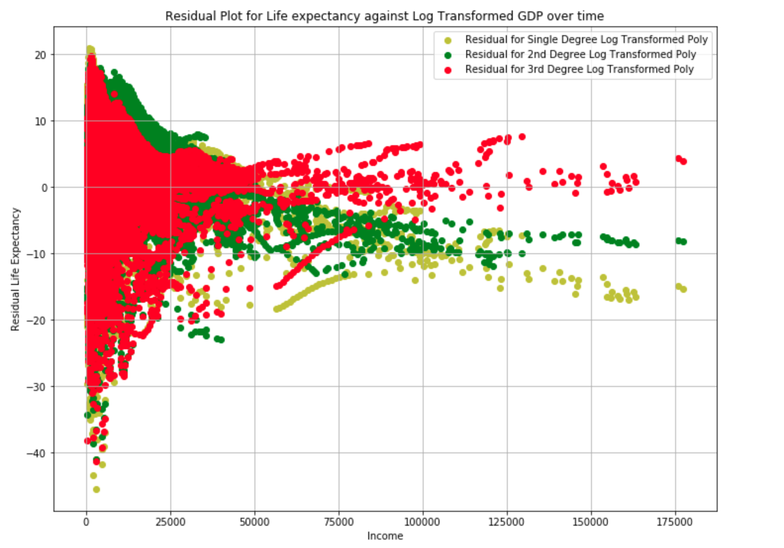

Also looking at the residual the third-degree polynomial is closer toward 0 than any other regressor above.

## Problem 5

Notebook link :
https://github.com/ParthTandel/DS5500-Assignment-2/blob/master/Question_2.ipynb

To see the relation here I plotted the child mortality over income similar to above with color blue as actual child mortality rate and yellow, green and red respectively for 1st, 2nd, and 3rd-degree regressor.

In the below plot we see that all the regressor lines are way off in representing the relation between both the variable. Also, we see that child mortality is inversely proportional to income. As income increase the child mortality rate decreases.

#### Plot for child mortality over income gdp
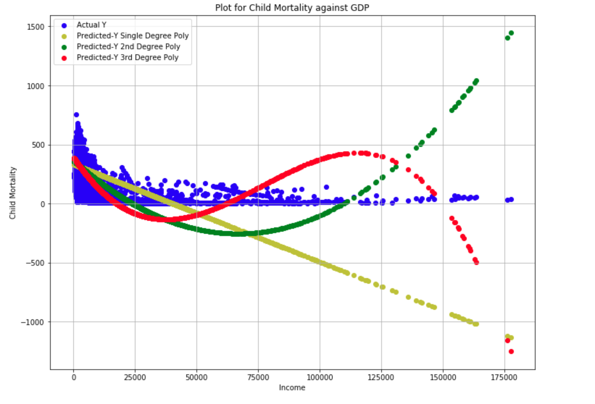

The mean square for the above regressor is as followed

    Mean square error for linear 1st-degree linear regression: 20077.780836437614
    Mean square error for linear 2nd-degree linear regression: 15595.930038339211
    Mean square error for linear 3rd-degree linear regression: 12728.78264364586

#### Residual plot for child mortality over income gdp
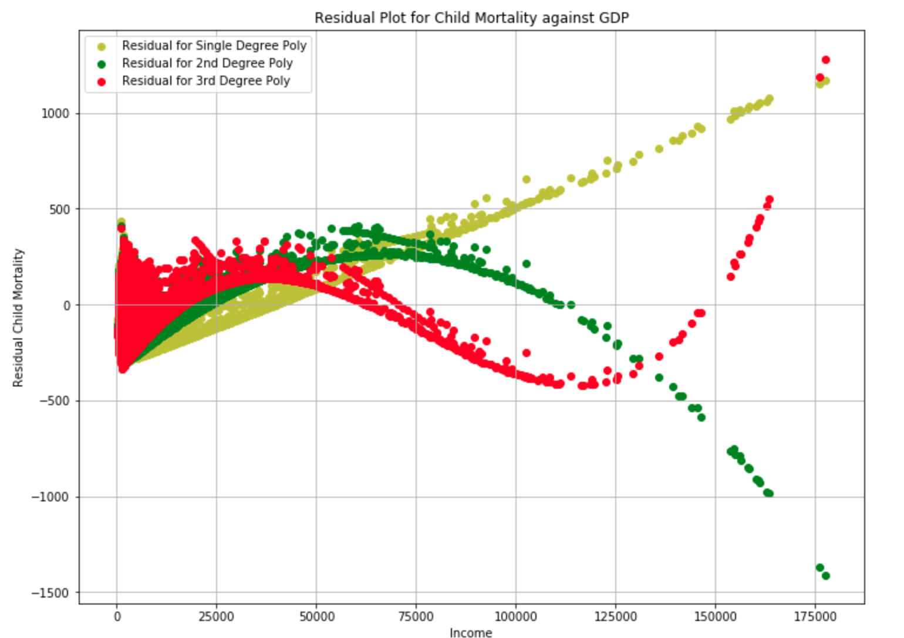

For each residual, we can see that the error is huge 

#### Further Analysis

As discussed above we saw that the relation between mortality rate and income as inversely proportional to each other. And also there is a logarithmic relation too. So I transformed income as a reciprocal of log income. 

    X = 1 / log(x)

Plotting the relationship shows that the models with the transformation fit the relationship. In particular, the 3rd-degree polynomial fits the best. One reason maybe it's just overestimating the relation.

#### Plot for child mortality over income GDP with reciprocal log transformation
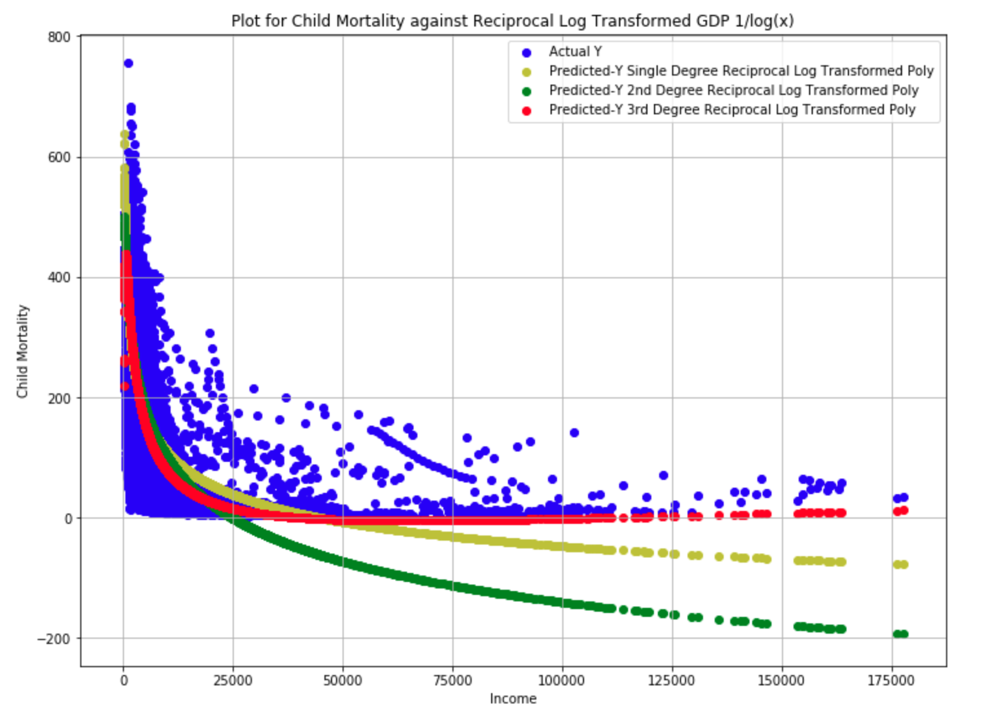

The mean square error for the models are as followed

    Mean square error for linear 1st-degree linear regression: 10252.523752002628
    Mean square error for linear 2nd-degree linear regression: 9731.74603221738
    Mean square error for linear 3rd-degree linear regression: 9118.267658465405

The mean square errors significantly reduced and the models became better at understanding the relation between income GDP and child mortality rate.

The residual of the models can be seen in this plot

#### Residual plot for child mortality over income GDP with reciprocal log transformation

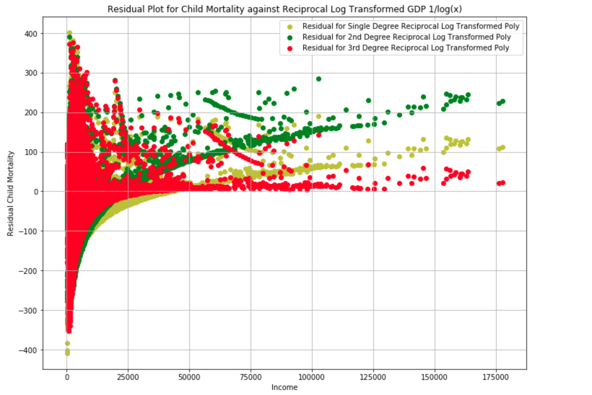

We see that the errors have reduced for all models and the predictions have improved.

#### Time Analysis

To see the involvement of time I build the same model with time as input too. Doing this I observed the estimation improved. This is expected as over time there has been an advancement in technology, medicine etc which was captured when including time as a variable. The below plot shows this relation.

#### Plot for child mortality over income GDP with reciprocal log transformation with respect to time

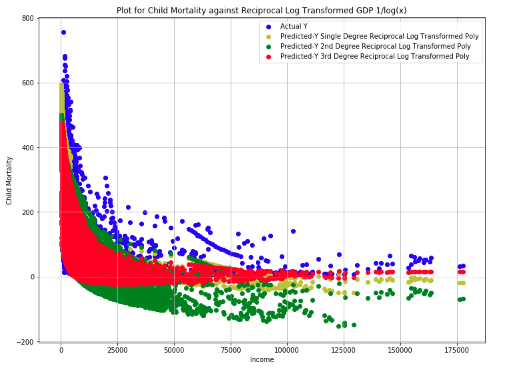

The mean square error of the plots is as followed.

    Mean square error for linear 1st-degree linear regression: 6156.205105344115
    Mean square error for linear 2nd-degree linear regression: 4325.340808813144
    Mean square error for linear 3rd-degree linear regression: 3731.6064446445944

The mean squared error, as usual, has reduced significantly as compared to the above build models.

#### Residual Plot for child mortality over income GDP with reciprocal log transformation with respect to time

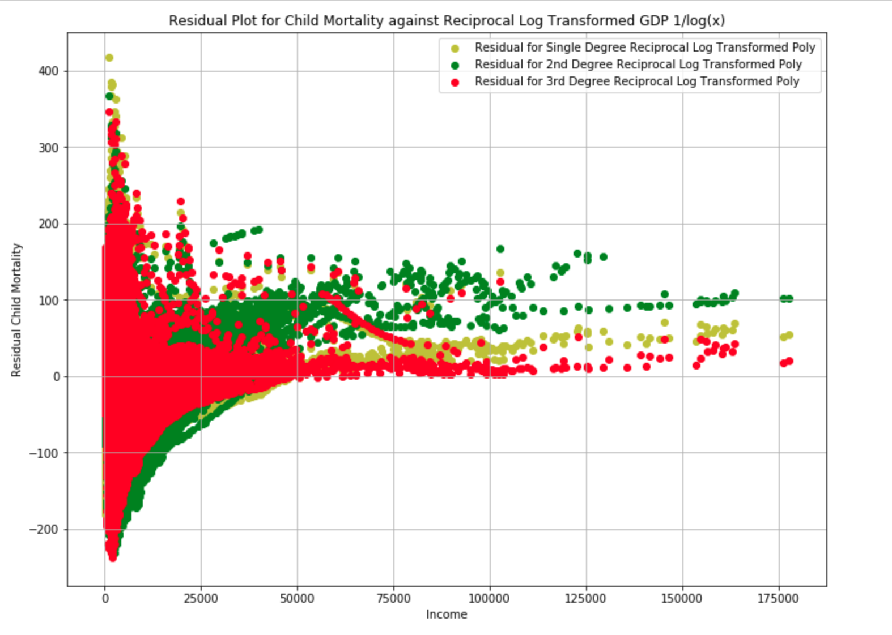

Residual Plot shows decrease in error for all model hence improving the estimation
